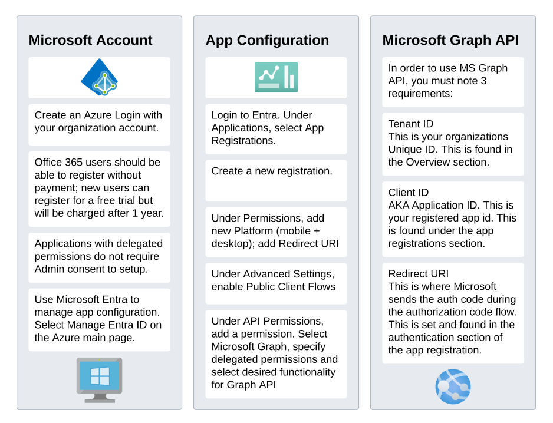
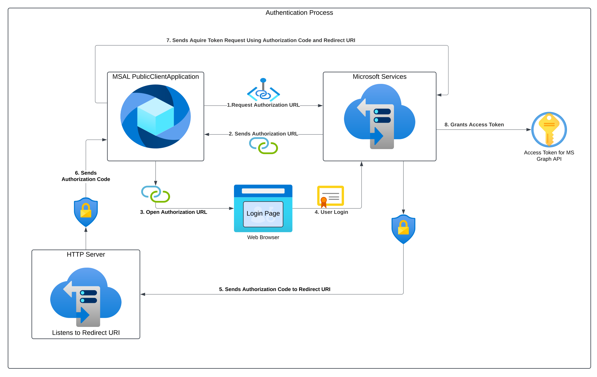

<h1>Background</h1>    
I was using pywin32 to read office365 work emails for one of my projects. 
Unfortunately, this has several problems:<br/><br/>
    1. Pywine can only interact with the full desktop Outlook app (office 365 download) NOT the Office apps installed in Windows by default.<br/>
    2. Outlook must store emails onto a local cache (limiting email search for very old emails).<br/>
    3. Pywin32 is an external library that must be downloaded for the script to work properly. (I prefer to keep things as built-in as possible)<br/>
<br/>
After some research I found possible solutions using pop/imap, EWS, and MS Graph API.<br/>

Pop, imap, and EWS must be enabled to use these these methods. Unfortunately, my organization does not allows these, and I cannot enable this without Admin Consent.

This left Microsoft Graph API.

<h1>Microsoft Graph API</h1>   
The only downside with Graph API is that a Microsoft Azure account is required. Fortunately, I was able to sign up for an Azure Account and create app permissions through
my organization.<br/>
<br/>Note: One can create an Azure Account for 'free' for a year, but credit card information is still required; do this at your own risk.

<h3>Azure Configuration</h3>
Azure App Configuration is a process in and of itself, especially for new users. <br/>
Here is a short diagram explaining the requirements for Graph API.



<h3>Authentication Process</h3>
After an app is registered with Azure (or Entra), you can write code to interact with the API.<br/>
Before you can use the API, you require a token. The process for retrieving the token with MSAL is shown below:

Tokens are then used in headers for requests on different endpoints to retrieve data.


<h3>Playing With Graph API Data</h3>


Microsoft's Documentation does not really go in detail with the api output data, BUT they provide a very useful tool for viewing this data:<br><br/>
https://developer.microsoft.com/en-us/graph/graph-explorer<br/>

You can use the Graph Explorer to better understand the data from graph requests for your purposes.<br/>
This tool allows you to change different api permissions, experiment with endpoints, etc. to receive data.<br/>
This is very helpful for interacting with data to understand what type of structures are sent through the requests.

For more information regarding Graph API, check out Microsoft's Documentation:
https://learn.microsoft.com/en-us/graph/overview


<h2>More General Information Regarding Graph API usage</h2>   

All endpoints are prefixed with https://graph.microsoft.com/v1.0/

1. User Information:
```
    endpoints = {
        "profile": "/me",
        "photo": "/me/photo",
        "manager": "/me/manager",
        "direct_reports": "/me/directReports"
    }
```
2. Email & Calendar:
```
    endpoints = {
        "messages": "/me/messages",
        "inbox": "/me/mailFolders/inbox/messages",
        "sent_items": "/me/mailFolders/sentItems/messages",
        "calendar": "/me/calendar",
        "events": "/me/events",
        "calendar_view": "/me/calendarView"
    }
```

3. OneDrive & Files:
```
    endpoints = {
        "my_files": "/me/drive/root/children",
        "shared_files": "/me/drive/sharedWithMe",
        "specific_folder": "/me/drive/root:/FolderName:/children"
    }
```
4. Teams:
```
    endpoints = {
        "my_teams": "/me/joinedTeams",
        "channels": "/teams/{team-id}/channels",
        "team_messages": "/teams/{team-id}/channels/{channel-id}/messages"
    }
```
5. Contacts:
```
    endpoints = {
        "contacts": "/me/contacts",
        "contact_folders": "/me/contactFolders"
    }
```
6. Common Query Parameters:
```
    params = {
        "$select": "field1,field2",  # Choose specific fields
        "$filter": "field eq 'value'",  # Filter results
        "$orderby": "field desc",  # Sort results
        "$top": 10,  # Limit results
        "$skip": 10,  # Skip first 10 results
        "$expand": "field",  # Include related entities
        "$search": '"keywords"'  # Search in content
    }
```
7. Example using search in emails:
```
    def search_emails(access_token, search_term):
        graph_url = "https://graph.microsoft.com/v1.0/me/messages"
    
        headers = {
            'Authorization': f'Bearer {access_token}',
            'Content-Type': 'application/json'
        }
        
        params = {
            "$search": f'"{search_term}"',
            "$top": 10,
            "$select": "subject,receivedDateTime,from"
        }
    
        response = requests.get(graph_url, headers=headers, params=params)
        return response.json()
```
Some tips:<br/>
&nbsp;&nbsp;- Use /beta instead of /v1.0 in the URL to access preview features<br/>
&nbsp;&nbsp;- Most endpoints support OData query parameters<br/>
&nbsp;&nbsp;- Some operations require different permission scopes<br/>
&nbsp;&nbsp;- Rate limits apply, so consider implementing pagination for large datasets<br/>


Mail attachments:
mail response will be metadata with attachments in the 'value' array
```
{
    "value": [
        {
            "id": "some-email-id",
            "subject": "Test Email",
            "attachments": [
                {
                    "id": "attachment-id-1",
                    "name": "document.pdf",
                    "contentType": "application/pdf",
                    "size": 123456,
                    "isInline": false
                },
                {
                    "id": "attachment-id-2",
                    "name": "image.jpg",
                    "contentType": "image/jpeg",
                    "size": 654321,
                    "isInline": false
                }
            ]
        }
    ]
}
```
**Notes: 
    1. Mail.ReadBasic App permissions only show limited mail information (no body is sent)
    2. Searching specific folders CANNOT be done with folder names; they must use folder_id.

to get the attachment, use the attachment id and the endpoint:

metadata:
/me/messages/{message-id}/attachments/{attachment-id}/


content:
/me/messages/{message-id}/attachments/{attachment-id}/$value
```
save_attachment(token, message_id, attachment_id, attachment_name):
    graph_url = https://graph.microsoft.com/v1.0/me/messages/{message-id}/attachments/{attachment-id}/$value
    attachment_url = https://graph.microsoft.com/v1.0/me/messages/{message-id}/attachments/{attachment-id}/$value

    headers = {
        'Authorization': f'Bearer {token}',
        'Content-Type': 'application/json'
    }

    response = requests.get(attachment_url, headers=headers)

    filename = f"{attachment_id}_{attachment_name}"
    
    with open(filename, 'wb') as f:
        f.write(response.content)
```